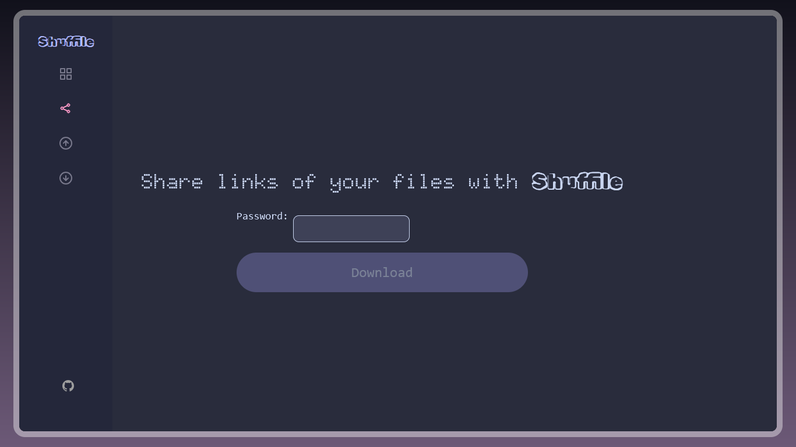

# `Shuffile Links` 📂

---

## SHUFFILE LINKS BUG 🐛
Shuffile Links was supposed to be deployed on [Hack CLub's Nest](https://hackclub.app) but had encourtered issues with subdomain creation and docker-mongo conflicts. While the issue is being resolved, you can access this feature by:
1. Clone this repo:
```git clone https://github.com/raghav-karn/shuffile-links.git```

2. Install npm packages:
```npm install```

3. Create a `.env` file in the root directory and add:
```
DATABASE_URL=mongodb://127.0.0.1/fileSharing
PORT=3000
```

4. Run the server by opening `localhost:3000` on your browser

---

**Note**: Shuffile only supports desktop as of now.

**Disclaimer**: This is a feature addon to the original project [**Shuffile**](https://github.com/raghav-karn/shuffile), maintaining a seperate repository to de-clutter Shuffile repository.

## Overview ✨
This is **Shuffile Links**, a feature added to [**Shuffile**](https://github.com/raghav-karn/shuffile) to generate and share password-protected files as links.

## Images 📸
**Preview of home page**:



## How I managed to pull this off 📃
> Shuffile Share required the knowledge of NodeJS, MongoDB (mongoose library), express libary, multer library and hashing using bcrypt library amonst others.

Here is how I managed to do this:
- Used express to handle files
- Created a file storing system using mongoose
- Wrote frontend in EJS (first time with it)
- Used bcrypt for hashing passwords
- Fitted into the Shuffile-esque design

## The fun part — Making things work! 😋
> It was fun to actually see each and every thing just work out — from creating links to adding password protection.

## The rough part — Designing¡ 🎊
> Designing to meet the design of Shuffile was a clear pain. The biggest pain was customizing the inputs, especially the file input. I wished to make it look like one of Shuffile Send but that didn't work out as planned, so I sorted to customizing the colors and fonts only. Also, I still can't change the width of inputs to be larger. Also, linking to `public/style.css` showed a MIME error, idk.

## Credits 🤝
**From online sources**: GeeksForGeeks (on working with EJS files), Duck AI (for linking CSS, could not resolve)

**From previous projects**: Shuffile

---
