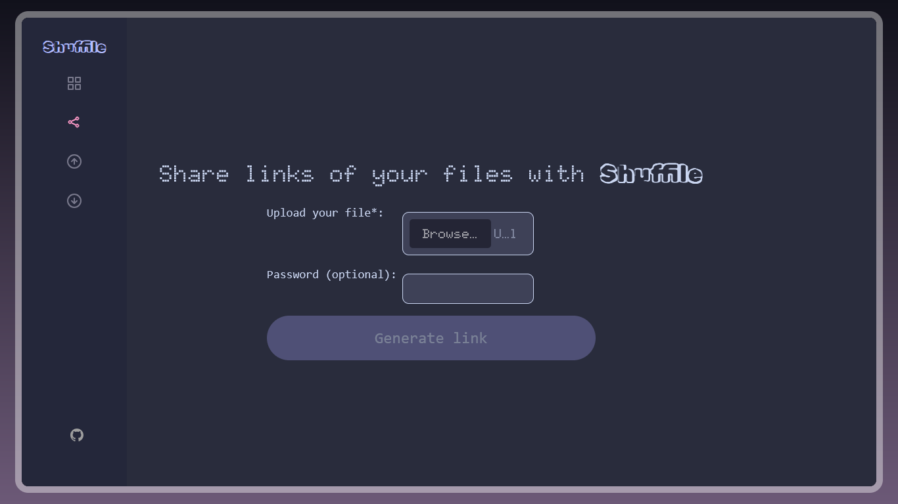

# `Shuffile Links` 📂

---

## SHUFFILE LINKS BUG 🐛
Shuffile Links was supposed to be deployed on [Hack CLub's Nest](https://hackclub.app) but had encourtered issues with subdomain creation and docker-mongo conflicts. While the issue is being resolved, you can access Shuffile Links (non-functional) from [http://37.27.51.34:38943/](http://37.27.51.34:38943/) or running it yourself by:
1. Clone the `Shuffile Links` repo:
```
git clone https://github.com/raghav-karn/shuffile-links.git
```

2. Install the npm packages required for Shuffile Links:
```
npm install
```

3. Create a `.env` file in the root directory and add:
```
DATABASE_URL=mongodb://127.0.0.1/fileSharing
PORT=3000
```

4. Run the server by opening `localhost:3000` (or on whatever port you define in your `.env` file) on your browser

---

**Note**: Shuffile Links is not deployed perfectly due to some (skill) issues with setting up MongoDB in Docker on Nest, and skill issues to deploying on Vercel/Render using MongoDB Atlas too. Also, adding a subdomain was bugged with Nest at the time of production of Shuffile.

**Disclaimer**: Shuffile only supports desktop as of now. This is a feature addon to the original project [**Shuffile**](https://github.com/raghav-karn/shuffile), maintaining a seperate repository to de-clutter Shuffile repository.

## Overview ✨
This is **Shuffile Links**, a feature added to [**Shuffile**](https://github.com/raghav-karn/shuffile) to generate and share password-protected files as links.

## Images 📸
**Preview of home page**:



## How I managed to pull this off 📃
> Shuffile Share required the knowledge of NodeJS, MongoDB (mongoose library), express libary, multer library and hashing using bcrypt library amonst others.

Here is how I managed to do this:
- Used express to handle files
- Created a file storing system using mongoose
- Wrote frontend in EJS (first time with it)
- Used bcrypt for hashing passwords
- Fitted into the Shuffile-esque design

## The fun part — Making things work! 😋
> It was fun to actually see each and every thing just work out — from creating links to adding password protection. It took me several iterations to try, experiment, experience and learn to make my first Node.js app and also on how to use Socket IO for sending files instead of texts. Socket IO is meant to send small signals, usually text, but here that is leveraged to send files — but that hinders the limit and speeds of Shuffile. But even so, it was very fun to make! Does not have the best design and the code may look a little cluttered but it is my favorite project because it's my first functional one! And then when I sent files from my laptop to my phone by the Nest client: OMG!

## The rough part — Designing¡ 🎊
> Designing to meet the design of Shuffile was a clear pain. The biggest pain was customizing the inputs, especially the file input. I wished to make it look like one of Shuffile Send but that didn't work out as planned, so I sorted to customizing the colors and fonts only. Also, I still can't change the width of inputs to be larger. Also, linking to `public/style.css` showed a MIME error, idk.
> I didn't sleep all night when High Seas was about to end in a few hours, just to grind on Shuffile and then find out High Seas is down. I spent all night trying to mess with Nest, MongoDB Atlas, Vercel and Render to deploy Shuffile Links but none of it worked, so had to put in it's non-functional port on Nest. Credits to Johannes for all the help with Nest.

## Credits 🤝
**From online sources**: GeeksforGeeks (for formatting file inputs), Duck AI (to help me deploy but no good), @skyfall on Hack Club's Slack (helped me a lot with tiny an issue of sending files), @Johannes on Hack Club's Slack (he was a hero in helping me set up Nest for Shuffile)

**From other projects**: Shuffile Links

---